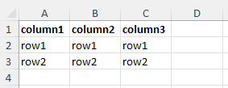

# ExcelUtils

This library to easily create excel worksheets, spreadsheets and files.

## Usage
1. Inject the service from container if you have one or create it
```
private ExcelFileFactory $excelFileFactor;

public function __construct(ExcelFileFactory $excelFileFactory) 
{
    $this->excelFileFactory = $excelFileFactory;
}
```
```
$excelFileFactory = new ExcelFileFactory($spreadsheetFactory);
```
2. Create the file with your data
```
$data = [
    [
        'column1' => 'row1',
        'column2' => 'row1',
        'column3' => 'row1'
    ],
    [
        'column1' => 'row2',
        'column2' => 'row2',
        'column3' => 'row2'
    ]
];

$filePath = $fileFactory->createFileWithData(new WorksheetData($data, 'my-sheet-name'), 'my_file.xlsx');
```
3. Get then result below

